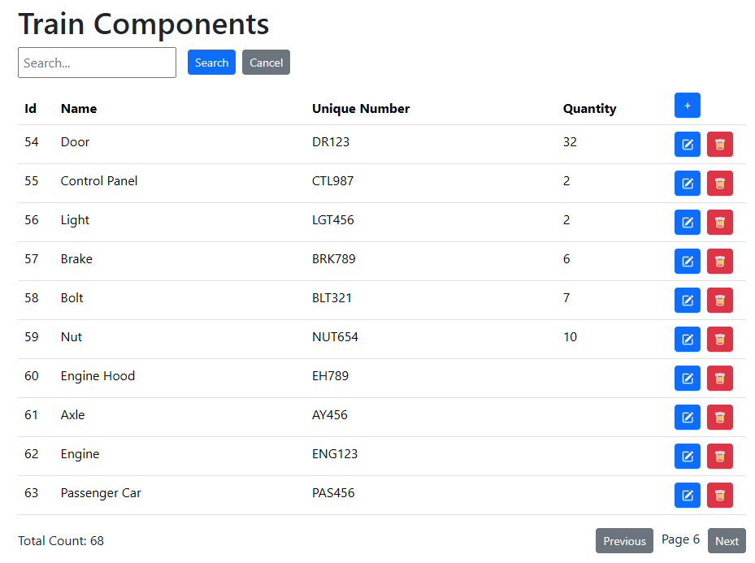
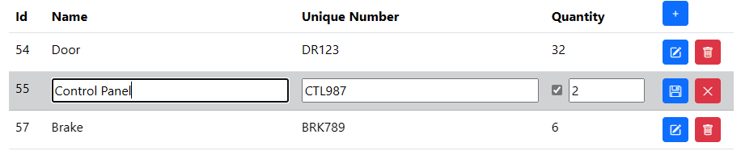
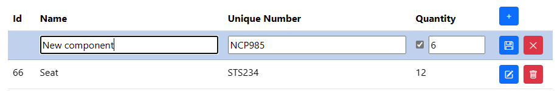
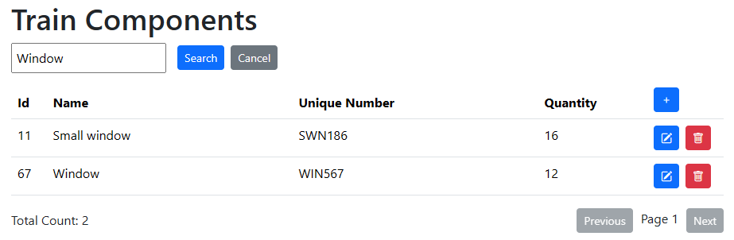

<h1 align="center">
  Train Components Management App 🚂🔧
</h1>

<p align="center">
  <a href="#-description">Description</a> •
  <a href="#-features">Features</a> •
  <a href="#-technologies">Technologies</a> •
  <a href="#-how-to-run-locally">How to Run Locally</a> •
  <a href="#-api-documentation-swagger">API Documentation</a> •
  <a href="#-screenshots">Screenshots</a>
</p>

## 📃 Description

This application is designed to manage train components. It provides a user interface to view, add, edit, and delete components, as well as search and paginate through the list. The application allows you to manage component details such as name, unique number, and quantity.

Here's an example list of items:

| Id  | Name          | Unique Number  | Can Assign Quantity |
| :-- | :------------ | :------------- | :------------------ |
| 1   | Engine        | ENG123         | No                  |
| 2   | Passenger Car | PAS456         | No                  |
| 3   | Freight Car   | FRT789         | No                  |
| 4   | Wheel         | WHL101         | Yes                 |
| 5   | Seat          | STS234         | Yes                 |

## 🚀 Features

* **View Components:** Displays a list of train components with details like ID, name, unique number, and quantity.
* **Add New Component:** Allows users to add new components with required details.
* **Edit Component:** Enables users to edit existing component details.
* **Delete Component:** Provides functionality to delete components.
* **Search Components:** Allows searching components by name or unique number.
* **Pagination:** Supports pagination to navigate through a large list of components.
* **Quantity Assignment:** Indicates whether a component can have an assigned quantity.
* **Error Handling:** Displays error messages for API failures.

## 🧑‍💻 Technologies

| Technology  | Version |
| :---------- | :------ |
| *Frontend*  |         |
| npm         | 10.9.2  |
| Angular     | 19.2.0  |
| *Backend*   |         |
| .Net        | 8.0     |
| Swagger     | 3.0.1   |
| MySQL       |         |

## 📎 How to Run Locally

### Prerequisites

* Node.js and npm installed.
* Angular CLI installed (`npm install -g @angular/cli`).
* .Net SDK installed.

### Steps

1.  **Clone the Repository:**
    ```bash
    git clone git@github.com:hpavlo/train_component_manager.git
    cd train_component_manager
    ```

2.  **Connect to MySQL:**
    * Open `TrainComponentManager.API/appsettings.json` file
    * Update `"DefaultConnection"` with your database name and connection credentials:
    ```
    "ConnectionStrings": {
        "DefaultConnection": "Server=localhost;Port=3306;Database=TrainComponents;Uid=<userId>;Pwd=<password>;"
    }
    ```

3.  **Run API:**
    * Navigate to the backend directory:
      ```bash
      cd TrainComponentManager.API
      ```
    * Run the .NET application:
      ```bash
      dotnet run
      ```
    * Ensure your backend application is running and accessible. Note the port it's running on.

4.  **Run Client:**
    * Open a new terminal window.
    * Navigate to the frontend directory:
      ```bash
      cd TrainComponentManager.UI
      ```
    * Install dependencies:
      ```bash
      npm install
      ```
    * Start the Angular application:
      ```bash
      npm start
      ```

5.  **Open in Browser:**
    * Open your browser and navigate to `http://localhost:4200/`

## 📚 API Documentation (Swagger)

The application includes Swagger for API documentation.

1.  **Access Swagger:**
    * Once your backend is running, open your browser and navigate to your swagger url: `http://localhost:5051/swagger/index.html`.
2.  **Explore Endpoints:**
    * You can explore all available API endpoints, their request/response models, and test them directly from the Swagger UI.

## 📷 Screenshots

- **Table of components**



- **Edit existed component**



- **Creating new component**



- **Search**


